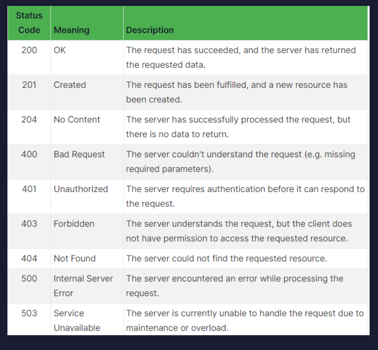

# What is Http?

HTTP stands for Hypertext Transfer Protocol. It is used to transfer data over the internet which allows communication between clients and servers.

### Example

suupose you are opennig and the browser and type facebook then teh browser sends an http request to the facebook server using your devie as aclinet then the server respondes that the facebook page diaplayed at your browser this is Http request response shortly

## Commponents of http

1:The status Line : infos abut message method and the url
2:The header : Additopnal infromations about the message
3: The body => the actual data sent or being recived Json ,Htnl,Xml

### Methods Of an Http

```
GET: Retrieves a resource from the server
POST: Inserts a resource in the server
PUT: Updates an existing resource in the server
DELETE: Deletes a resource from the server
```

### Status codes

